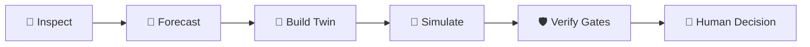
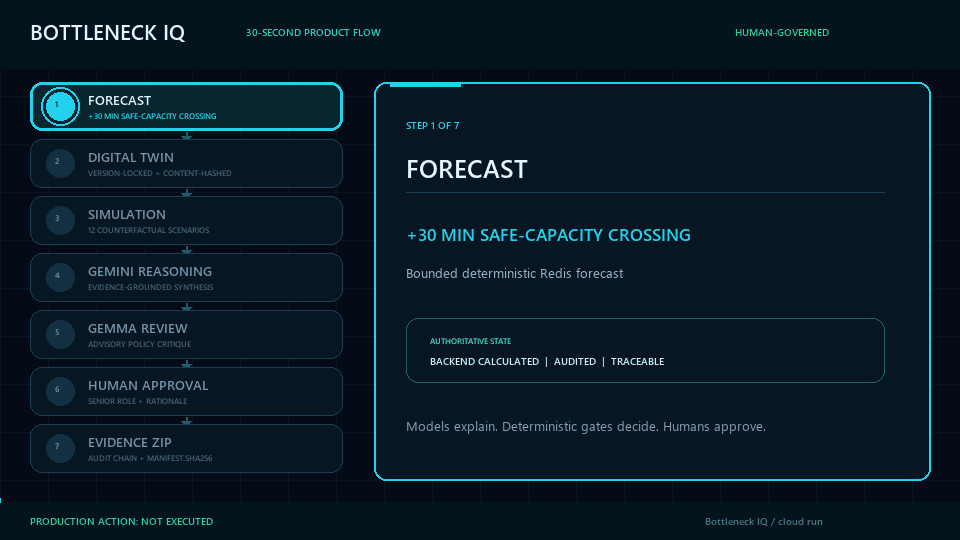
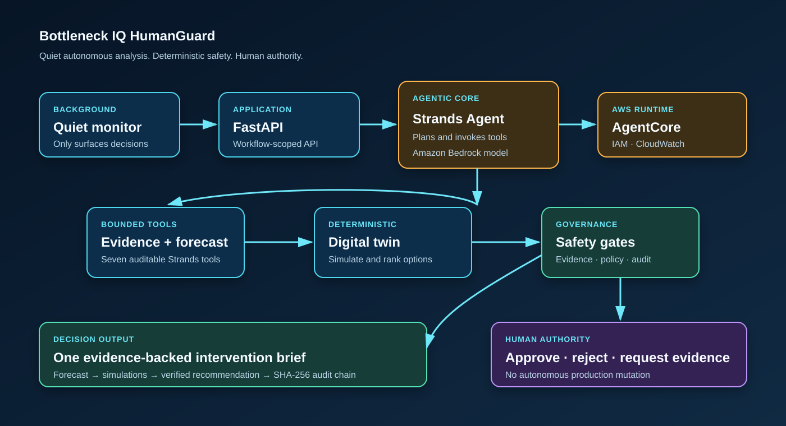
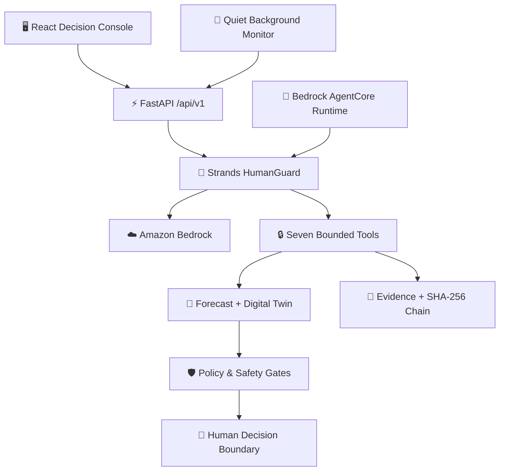

<p align="center">
  
</p>

<h1 align="center">🧠 Bottleneck IQ HumanGuard</h1>

<p align="center">
  <strong>Evidence-first operational intelligence for WCC</strong><br/>
  Predict the next bottleneck, test safe interventions, and surface only the decision a human must make.
</p>

<p align="center">
  
  
  
  
  
  
  
</p>

<p align="center">
  <a href="#quick-start"><strong>Quick Start</strong></a> ·
  <a href="#working-model"><strong>Working Model</strong></a> ·
  <a href="#architecture"><strong>Architecture</strong></a> ·
  <a href="#guided-demo"><strong>Guided Demo</strong></a> ·
  <a href="#verification"><strong>Verification</strong></a>
</p>

> [!IMPORTANT]
> **Working-build status:** the complete deterministic workflow runs locally without cloud credentials. Live Strands + Amazon Bedrock reasoning is an optional authenticated mode.<br/>
> **Safety boundary:** HumanGuard prepares evidence and a decision brief. It never deploys, scales, rolls back, or changes production infrastructure.

---

## 🏆 WCC Mission

Operations teams lose critical time collecting telemetry, reconstructing incidents, testing mitigations, checking policy, and preparing an approval request. Bottleneck IQ HumanGuard handles that investigation loop and remains quiet until a material human decision is ready.



This is not an auto-remediation bot. It is a bounded reliability agent that gathers evidence, predicts a bottleneck, rejects unsafe interventions, explains the verified recommendation, and stops at the human-control boundary.

---

## ✨ Why Bottleneck IQ Stands Out

| Capability | What the operator receives | Why it matters |
|---|---|---|
| 🔭 Early bottleneck forecast | Safe-capacity crossing and likely impact window | Moves response from reactive to preventive |
| 🧬 Bounded Digital Twin | Versioned, content-hashed operational model | Makes every replay traceable |
| 🧪 Deterministic scenario lab | Reproducible failures and interventions | Produces independently verifiable evidence |
| 🏟️ Intervention tournament | FAST, SAFE, and OPTIMAL compared on one Twin | Prevents recommendation by intuition alone |
| 🛡️ Mandatory safety gates | Unsafe candidates are disqualified before ranking | Makes safety a rule, not a suggestion |
| 🤖 Strands tool orchestration | Seven named, workflow-scoped tools | Keeps agent action inspectable and bounded |
| 👤 Human-governed approval | Named decision, rationale, and audit record | Preserves accountability and control |
| 📦 Evidence export | Verifiable package with hashes and audit events | Supports review and reproducibility |

---

<a name="working-model"></a>

## ⚙️ Working Model

HumanGuard has two clearly labelled execution modes:

| Mode | Credentials | Behaviour |
|---|---|---|
| **Deterministic offline model** | None | Runs all seven bounded tools, reaches `AWAITING_HUMAN`, and produces reproducible evidence |
| **Strands + Bedrock model** | AWS credentials with Bedrock access | Lets the Strands agent select and explain the same bounded tool workflow |

The deterministic services—not the language model—own forecasts, simulations, hashes, rankings, and mandatory policy gates. If AWS is unavailable and fallback is enabled, the API reports `deterministic-offline-fallback`; it never claims that Bedrock ran.

### Seven bounded agent tools

| Strands tool | Work performed |
|---|---|
| `inspect_operational_state` | Loads persisted workflow state |
| `collect_operational_evidence` | Collects and hashes decision evidence |
| `forecast_bottleneck` | Runs the transparent capacity forecast |
| `build_bounded_digital_twin` | Creates a workflow-scoped Twin |
| `simulate_interventions` | Replays bounded intervention scenarios |
| `rank_and_verify_interventions` | Applies ranking and mandatory gates |
| `prepare_human_decision_brief` | Produces the final human review package |

Every call is recorded in the tamper-evident audit timeline. No production-mutation tool is exposed.

---

## 🎯 Canonical Workflow

The seeded Payment Service begins healthy while traffic and Redis pressure rise. HumanGuard:

1. detects the weak early signal;
2. forecasts Redis safe-capacity crossing at **+30 minutes**;
3. estimates customer impact at **+45 minutes**;
4. creates a hashed, bounded Digital Twin;
5. replays **12 deterministic scenarios**;
6. evaluates FAST, SAFE, and OPTIMAL interventions;
7. rejects FAST because it fails mandatory failover safety;
8. recommends the highest-scoring eligible option;
9. produces an evidence-backed decision brief; and
10. stops for a named human decision.

> [!CAUTION]
> **Eligibility overrides score.** A failed mandatory gate can never be outweighed by predicted benefit, confidence, or business value.

---

## 📊 Validation Evidence

| Technical question | Evidence-backed answer |
|---|---|
| What bottleneck is emerging? | Redis saturation on the Payment Service critical path |
| When is safe capacity crossed? | **+30 minutes** in the canonical deterministic seed |
| When may customers be affected? | **+45 minutes**, subject to displayed assumptions |
| How many scenarios are replayed? | **12**, using the same Twin manifest and fixed seed |
| Which false fix is detected? | **FAST**, rejected by the mandatory failover safety gate |
| Which strategy is recommended? | Highest-scoring eligible candidate; currently **OPTIMAL** |
| Is confidence a probability? | No—it is a heuristic evidence score |
| Is revenue exposure guaranteed? | No—it is an operational estimate from visible inputs |
| Does approval deploy anything? | No—it records a human decision and enables evidence export |

## 🛡️ Intervention Decision Matrix

| Intervention | Intent | Mandatory gates | Eligible | Decision |
|---|---|---|---|---|
| ⚡ **FAST** | Scale application replicas immediately | ❌ Failover safety fails | **No** | Disqualified regardless of score |
| 🛟 **SAFE** | Redis capacity + controlled failover + traffic shaping | ✅ Pass | **Yes** | Lower-cost eligible alternative |
| 🎯 **OPTIMAL** | Redis capacity + cache-policy correction + gradual scaling | ✅ Pass | **Yes** | Recommended by transparent score |

### Twelve deterministic scenarios

| # | Scenario | # | Scenario |
|---:|---|---:|---|
| 01 | Baseline growth | 07 | Reduced Redis capacity |
| 02 | Redis crash | 08 | Increased application replicas |
| 03 | Redis latency | 09 | Rollback |
| 04 | Replica failover | 10 | Rate limiting |
| 05 | 10× traffic | 11 | Cache-policy correction |
| 06 | One-million-user stress | 12 | Configuration drift |

---

<a name="guided-demo"></a>

## 🎬 Guided Demo



The React command centre includes a guided, stage-by-stage WCC experience and an explore mode backed by persisted API data.

- Early signal and rising Redis pressure
- Transparent `+30` / `+45` forecast
- Hashed Digital Twin and evidence provenance
- Twelve-scenario replay
- False-fix rejection
- Human approval boundary

Open `http://localhost:5173/judge-demo` after starting the application. Guided playback never presses an approval button.

### Recommended five-minute demo route

| Time | Demonstrate | Proof point |
|---|---|---|
| 0:00–0:40 | Mission and rising Redis pressure | Healthy-now does not mean safe-next |
| 0:40–1:20 | +30 and +45 forecast | Early warning precedes reactive alert |
| 1:20–2:05 | Twin manifest and hash | Model boundary and evidence are explicit |
| 2:05–3:15 | Twelve-scenario replay | Results are deterministic and inspectable |
| 3:15–4:10 | FAST rejection and OPTIMAL selection | Safety gates override score |
| 4:10–5:00 | Human decision and export boundary | Governance is built into the workflow |

---

<a name="architecture"></a>

## 🏗️ Architecture





The Digital Twin is a bounded operational model under documented assumptions—not a claim of perfect production replication.

### Safety by design

Only backend policy changes workflow state. Human approval means:

1. record the named decision and rationale;
2. append it to the chained audit timeline; and
3. permit evidence export.

It never means deployment or production execution.

---

<a name="quick-start"></a>

## 🚀 Quick Start

### Prerequisites

- Python **3.11+**
- Node.js **20+**
- pnpm (recommended) or npm

### Windows — one click

Clone the repository, then double-click:

```text
start-bottleneck-iq.cmd
```

The launcher creates an isolated `.venv`, installs the lightweight offline model and frontend dependencies, builds the production UI, starts all three services, waits for health checks, and opens the dashboard.

### PowerShell / Linux / macOS

```bash
python -m venv .venv
```

Activate the environment:

```powershell
# Windows PowerShell
.\.venv\Scripts\Activate.ps1
```

```bash
# Linux or macOS
source .venv/bin/activate
```

Then install and run:

```bash
pip install -e '.[dev]'
cd frontend
pnpm install
cd ..
python scripts/run_demo.py
```

Open:

- 🖥️ Dashboard: `http://localhost:5173`
- 🎬 WCC guided demo: `http://localhost:5173/judge-demo`
- 📚 API documentation: `http://localhost:8000/docs`
- 🩺 API health: `http://localhost:8000/health`

### Live Strands + Amazon Bedrock

Install the optional AWS integration:

```bash
pip install -e '.[dev,aws]'
```

Copy `.env.example` to `.env` and configure:

```dotenv
STRANDS_ENABLED=true
STRANDS_OFFLINE_FALLBACK=true
AWS_REGION=us-east-1
BEDROCK_MODEL_ID=global.anthropic.claude-sonnet-4-6
BACKGROUND_MONITOR_ENABLED=false
BACKGROUND_MONITOR_INTERVAL_SECONDS=60
```

The normal AWS credential chain is used; secrets are never embedded in the application.

### Invoke HumanGuard

After seeding a workflow in the UI:

```bash
curl -X POST http://localhost:8000/api/v1/workflows/1/strands/invoke \
  -H 'Content-Type: application/json' \
  -d '{"prompt":"Assess this workflow end to end and prepare a human decision brief."}'

curl http://localhost:8000/api/v1/strands/status
```

---

<a name="verification"></a>

## ✅ Verification

```powershell
.\.venv\Scripts\python.exe -m pytest backend\tests demo_app\tests -q
.\.venv\Scripts\python.exe -m ruff check backend demo_app scripts
.\.venv\Scripts\python.exe -m mypy backend demo_app scripts
Set-Location frontend
pnpm test
pnpm run build
```

Current result: **96 backend tests passed** and **37 frontend tests passed**. The production frontend bundle also builds successfully. Determinism is part of the product contract: the same Twin manifest, seed, controls, and scenario definition produce the same inspectable outcome hash.

---

## 🧰 Technology Stack

| Layer | Technology |
|---|---|
| Agent | Strands Agents SDK with seven custom tools |
| Managed model | Amazon Bedrock |
| Managed runtime | Amazon Bedrock AgentCore entrypoint |
| Backend | Python 3.11+, FastAPI, Pydantic, SQLAlchemy |
| Persistence | SQLite for deterministic local/demo operation |
| Frontend | React 18, TypeScript, Vite, TanStack Query, Recharts |
| Quality | Pytest, Ruff, MyPy, Bandit, Vitest |
| Delivery | Docker Compose, Render, AgentCore deployment assets |

---

## 📈 Implementation Status

| Layer | Status |
|---|---|
| Deterministic offline model and seeded workflow | ✅ Implemented and tested |
| FastAPI, SQLite persistence, evidence, and audit chain | ✅ Implemented and tested |
| React decision console and guided WCC workflow | ✅ Implemented and builds |
| Digital Twin, scenarios, tournament, and safety gates | ✅ Implemented and tested |
| Strands custom tools and truthful offline fallback | ✅ Implemented and tested |
| Live Amazon Bedrock reasoning | 🔐 Requires AWS credentials and model access |
| AgentCore deployment entrypoint | 🟡 Deployment-ready; not claimed live without an ARN |

---

## ⚖️ Honest Limitations

- Included telemetry is deterministic seeded demonstration data, not a live enterprise feed.
- Forecasting is a transparent bounded model, not a calibrated probability.
- Simulation covers documented variables and is not a complete production replica.
- Business-impact outputs are estimates, not guaranteed savings.
- Live Bedrock and AgentCore evidence require authenticated AWS execution.
- HumanGuard has no production-action tool by design.

---

## 📚 WCC Documentation

| Guide | Purpose |
|---|---|
| [WCC submission description](docs/WCC_SUBMISSION.md) | Product story and judging alignment |
| [Five-minute demo script](docs/WCC_DEMO_SCRIPT.md) | Reproducible WCC walkthrough |
| [AWS and Strands architecture](docs/AWS_STRANDS_ARCHITECTURE.md) | Managed model and runtime design |
| [Submission checklist](docs/WCC_SUBMISSION_CHECKLIST.md) | Final evidence checklist |
| [AgentCore deployment guide](deploy/agentcore/README.md) | Authenticated deployment steps |
| [API reference](docs/api.md) | Versioned endpoints and contracts |
| [Safety model](docs/safety.md) | Mandatory gates and human authority |

---

## 🤖 Agent Workforce

The workforce is a transparent set of bounded specialists. Each agent reads validated artifacts, writes inspectable outputs, and returns control to the orchestrator. None can execute a production change.

| Agent | Responsibility | Output |
|---|---|---|
| **Nexus Orchestrator** | Coordinates state transitions and enforces non-execution | Workflow state and audit links |
| **Observer** | Normalises the operational window | Telemetry observations |
| **Evidence** | Validates evidence and hashes | Evidence catalogue and gap report |
| **Process Discovery** | Reconstructs service topology and critical path | Dependency map |
| **Prediction** | Forecasts safe-capacity crossing | Forecast, assumptions, confidence |
| **Digital Twin** | Binds evidence into a bounded Twin manifest | Versioned Twin hash |
| **Simulation** | Replays deterministic counterfactuals | Scenario results and hashes |
| **Optimization** | Ranks only gate-eligible interventions | FAST/SAFE/OPTIMAL tournament |
| **Verification** | Checks gates and audit readiness | Verification result |
| **Business Impact** | Estimates customer and commercial exposure | Formula-backed impact estimate |
| **Executive** | Prepares the final decision brief | Recommendation and uncertainty |

### API surface

The versioned API covers workflows, evidence, telemetry, Twin generation, simulations, intervention ranking, approvals, export, workforce views, and Strands invocation. OpenAPI is available at `/docs` on the API service.

| Surface | Purpose |
|---|---|
| `/api/v1/workflows` | Create and inspect bounded investigations |
| `/api/v1/workflows/{id}/strands/invoke` | Run the live or deterministic agent path |
| `/api/v1/strands/status` | Report SDK, model, and AgentCore readiness truthfully |
| `/api/v1/agents` | Browse the agent catalogue and artifacts |
| `/api/v1/evidence` and `/api/v1/audit` | Inspect provenance and chained events |
| `/api/v1/verification` | Run and inspect mandatory safety checks |
| `/api/v1/export` | Produce a reviewable evidence package |

---

## 🎥 Narrated Walkthrough

The repository includes a short guided-flow asset at [`docs/assets/bottleneck-iq-30-second-flow.gif`](docs/assets/bottleneck-iq-30-second-flow.gif) and a reproducible script at [`docs/WCC_DEMO_SCRIPT.md`](docs/WCC_DEMO_SCRIPT.md).

1. Start with a healthy-looking Payment Service and a quiet reactive alert.
2. Reveal rising Redis pressure and the transparent **+30 / +45 minute** forecast.
3. Open the Twin manifest and its content hash.
4. Replay twelve scenarios and compare intervention candidates.
5. Show FAST being disqualified by a mandatory safety gate.
6. Surface the eligible recommendation and stop at the named human decision.

Every stage is inspectable, evidence references remain visible, and guided playback never approves or executes a production action.

---

## ☁️ Deployment Notes

The checked-in [`render.yaml`](render.yaml) defines three public Render services:

| Service | Role | URL |
|---|---|---|
| `janicebenita-bottleneck-iq` | React static command centre | [Open website](https://janicebenita-bottleneck-iq.onrender.com) |
| `janicebenita-bottleneck-iq-api` | FastAPI workflow and agent API | [Open API](https://janicebenita-bottleneck-iq-api.onrender.com) |
| `janicebenita-bottleneck-iq-simulator` | Demo simulator and seeded support service | [Open simulator](https://janicebenita-bottleneck-iq-simulator.onrender.com) |

Free Render services are suitable for a demo or review environment. They may sleep after inactivity, have finite monthly instance hours, and use ephemeral local storage. For production operation, use authenticated cloud model access, persistent database storage, monitoring, and a paid service plan.

AgentCore deployment assets live under [`deploy/agentcore`](deploy/agentcore). Deployment is manual and requires AWS credentials; the application never claims a live managed runtime without authenticated evidence.

---

## ❓ Technical Q&A

**Is the model autonomous?** It coordinates bounded investigation steps, but deterministic services own calculations and policy. A human remains the authority for consequential decisions.

**What happens without AWS credentials?** The API runs the deterministic offline path and reports `deterministic-offline-fallback`. It never labels that run as Bedrock execution.

**Can the agent change production?** No. Those tools do not exist in the exposed tool set. Approval records a decision and enables evidence export only.

**Is the forecast a probability?** No. It is a transparent bounded forecast based on visible seeded measurements and documented assumptions.

**Why use a Digital Twin?** The Twin freezes the evidence, controls, limits, and seed used for counterfactual analysis so another reviewer can reproduce the result.

**Why can a lower-scoring intervention win?** Eligibility is evaluated before score. A candidate that fails a mandatory safety gate is disqualified regardless of predicted benefit.

**What is the path from demo to production?** Connect real telemetry, replace SQLite with durable storage, configure least-privilege AWS access, deploy the AgentCore entrypoint, add authenticated observability, and preserve the same evidence and human-control contracts.

---

## 🗺️ Production Evolution

| Phase | Extension | Invariant preserved |
|---|---|---|
| 1 | Connect live telemetry and traces | Inputs remain attributable and hashable |
| 2 | Add durable evidence and audit storage | History remains exportable and tamper-evident |
| 3 | Enable authenticated Bedrock reasoning | Model claims remain separate from deterministic authority |
| 4 | Deploy AgentCore with least-privilege IAM | Runtime evidence is required before live claims |
| 5 | Add enterprise eventing and SLO integrations | No production mutation is introduced implicitly |

---

## 👩‍💻 Author

Built by **[Janice Benita F](https://github.com/Janicebenita)** for WCC.

[MIT licensed](LICENSE). Contributions should preserve deterministic evidence, mandatory gates, the human approval boundary, and the absence of automatic production execution.

---

<p align="center">
  <strong>Predict early. Simulate safely. Decide with evidence.</strong><br/>
  <sub>Bottleneck IQ HumanGuard · Operational Intelligence with Human Control</sub>
</p>
