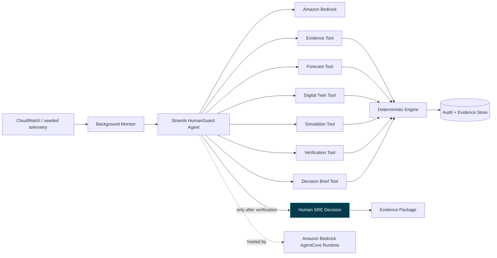

# AWS Strands architecture

## Authority model

The Strands model decides which bounded investigative tools to call. The model
does not calculate authoritative operational values. Forecasting, scenario
replay, candidate eligibility, mandatory gates, workflow transitions, role
authorization, and audit hashing remain deterministic backend responsibilities.

No Strands or AgentCore tool can deploy, scale, roll back, execute shell
commands, approve a recommendation, or mutate production infrastructure.

## Background behavior

When `BACKGROUND_MONITOR_ENABLED=true`, an application-lifespan task examines
the newest actionable workflow at the configured interval. It stays quiet when
there is no new work or a decision is already pending. A completed investigation
ends in `AWAITING_HUMAN` and is visible through the existing UI and audit stream.

## AWS services

- **Strands Agents SDK:** autonomous planning and bounded tool selection.
- **Amazon Bedrock:** managed model inference and optional Guardrails.
- **Amazon Bedrock AgentCore Runtime:** production hosting contract and deployment path.
- **CloudWatch/OTel:** AgentCore observability target after authenticated deployment.
- **IAM:** runtime identity and least-privilege Bedrock invocation.

AgentCore and CloudWatch are documented as deployment targets until an
authenticated deployment and trace have been captured. The local deterministic
fallback is visibly labeled and is never represented as a live Strands run.
